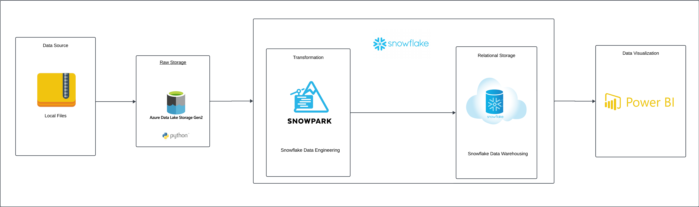

# Azure End-To-End CRM Data Pipeline

# Project Overview
---

This is a End-To-End Azure & Snowflake analytics engineering project where I used Python, SnowSQL, SnowPark & Power BI. Multiple CRM files are read from local storage and pushed to Azure Data Lake Gen2. From there I used snowSQL to build a virtual data warehouse to stage and manage my data. SnowPark was used to transform and clean the data. Power BI was used as the visualization tool used for analytical consumption. 
